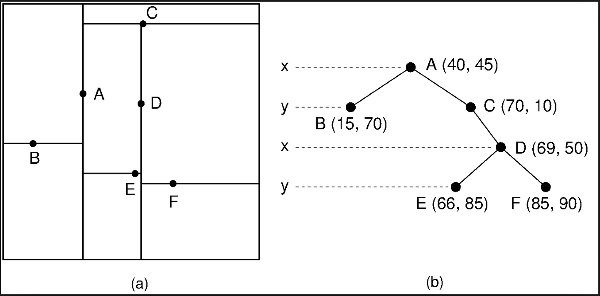

# Machine Learning 

## Feb. 1, 2019

### Instance-Based Learning

**Topics:** KNN classification, KNN regression, edited nearest neighbor, k-d trees for nearest neighbor identification

**Nearest Neighbor Classification** 
_Learning Task_ Given a training set, do nothing. This is sometimes called a lazy learner becasue the algorithm just stores the locations and relative distnaces of points in memory.

_Classification Task:_ Given an instnace to classify, find the instnace in the training set most similar to the instance and return the class label of the training set instance.

_Methods of determining instance similarity:_

- Hamming Distance: Count the number of features where the instnace shares the same value (only applies to discrete feature spaces)
- Euclidean distance
- Manhattan distance
- and several others

_Note:_ KNN is very sensitive to the sclaing of the features because numerical distnaces are based on positions in the feature space. This means that features with different ranges will be weighted differently in the classification. A typical technique is to standardize the features by subtracting the mean and dividing the result by the standard deviation.

**Nearest Neighbor Regression**

_Learning Task:_ Given a training set, do nothing.

_Classification Task:_ given an instance to make a prediction for, find the k most similar instances in the training set and return the value of the training set instances. THis value coule be the average of the k features, the max, etc.

**Distance-Weighted Nearest Neighbor**

Another tweak to this algorithm can be weighting the votes of the newarest neighbors by their distances. In the case of regression, we can implement this tweak by performing a weighted-average when deciding the value to return

**Speeding up KNN**

KNN can have a lengthy classificaiton time if the training set is large since you need to compare the instance to each instance in the training set. We will two main ways to speed up the algorithm

_Edited KNN:_ Select a subset of instances that still provide accurate classifications to do the comparisons.

- Incremental Deletion: Start with all training instances in memory. For each training instance, if other instances in memory provide correct classification, delete it from memory
- Incremental Growth: Start with no training instances in memory. For each training instance, if the existing training instances in memory do not provide the correct classification, add the training instance to memory.

_Note:_ These two methods are sensitive to the order of incrementation through the training set. One builds up the decision boundary and one strips away things far from the decision boundary, but the final shape of the boundary depends on which instances were evaluated first.

**K-D Trees**

These are data structures that index a set of instnaces in a way where we do not have to check every instance every time in the application of KNN. Each internal node (non-leaf) in the tree stores one instnace and has a boolean test on the median value of the feature haveing the highest variance

A good resource for k-d trees can be found [here](http://pointclouds.org/documentation/tutorials/kdtree_search.php)

Steps for finding nearest neighbor(s) with a k-d tree:

- Use a branch and bound search
- Use a priority queue to store (1) the nodes considered and (2) the lower bound on their distance to the query instance
- The lower bound is given by distance using a single feature

Run times for traiing sets of size N: Average = O(log N), Worst case = O(N). This performance is much better than the O(N^2) performance of checking every training instance against every other trainnig instance.