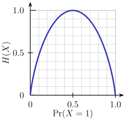
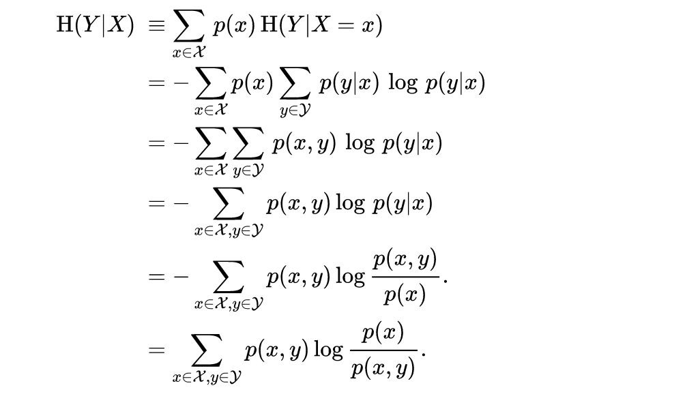
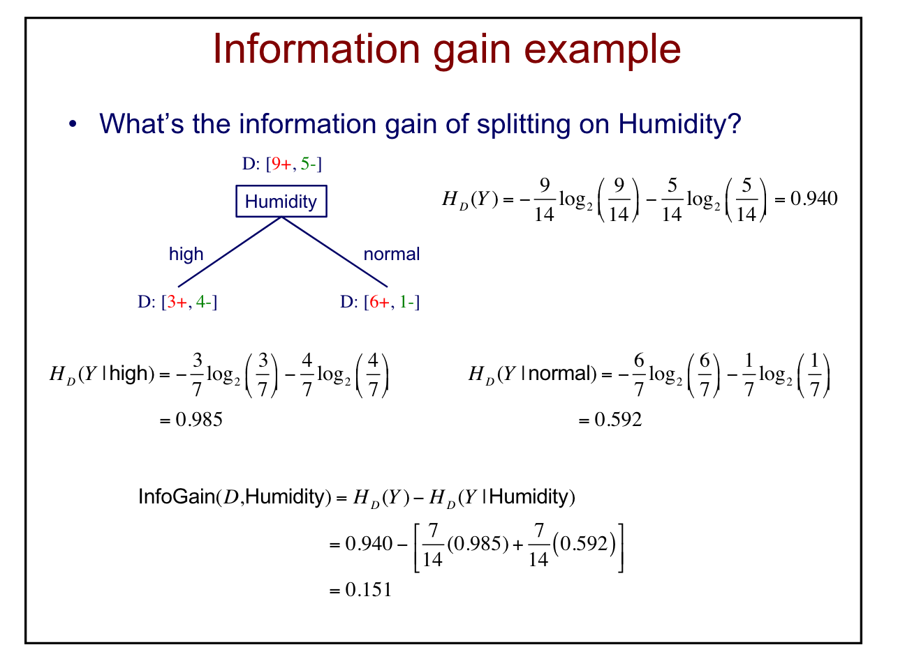
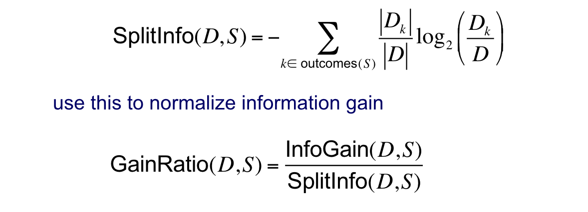

# Machine Learning 

## Feb. 4, 2019

### Strengths and Limitations of KNN

Advantages: simple to implement, training is efficient, adapts well to on-line learning, robust to noisy data (k > 1), and often works well in practice

Disadvantages: sensitive to range of feature values, sensitive to irrelevant and correlated features, classification and prediction can be inefficient, doesn't provide much insight because there is no explicit model


### Decision Trees

Pseudo-code implementation of the algorithm structure

```
MakeSubtree(set of training instances D)
	C = DetermineCandidateSplits(D)
	if stopping criteria met
		make a leaf node N
		determine class label / probabilities for N
	else
		make an internal node N
		S = findBestSplit(D,C)
		for each outcome k of S
			Dk = subset of instances that have outcome k
			kchild = MakeSubtree(Dk)
	return subtree rooted at N
```

**Determine the candidate locations for making a split**

Splits on nominal features have one branch per value. Splits on numeric features split based on a threshold.

In the case of numeric features, we have to determine the threshold values:

- Sort the values of a feature F for all instances in a training dataset D
- Evaluate the split thresholds in intervals between instances of different classes. This evalutation is done in the context of a cost-function and depends on the context of the problem at hand.

**Finding the best splits**

_The simplest tree that solves the classification problem will likely generalize best to unseen data_

Entropy: a measure of uncertianty associated with a random variable. Specifically we define it as the expected number of bits required to communicate the calue of the variable

$$H(y) = -\sum_{y \in \textrm{values}(Y)} P(y)\log_2 P(y) $$



Conditional Entropy:

$$H(Y|X) = \sum_x P(X=x)H(Y|X=x)$$

where

$$H(Y|X=x) = -\sum_y P(Y=y | X=x) \log_2 P(Y=y | X=x)$$



Information Gain: Defined as Entropy minus the Condiditonal Entropy

$$\textrm{InfoGain}(D,S) = H_D(Y) - H_D(Y|S)$$

- By using information gain, we remove the influence of contitional entropy, so we can truly answer the question: does the split decrease the total entropy?



### Limitation of Information Gain

Information gain is biased towards tests with many outcomes. For example, consider a single feature that uniquely identifies each training instance. Splitting on this feature would result in many pure branches and maximal information gain. This issue only presents itself if we allow the splits in a tree to be nonbinary.

In situations with nonbinary splits, you can use the _Gain Ratio_. The Gain Ratio is a normalization of the information gain as follows:

