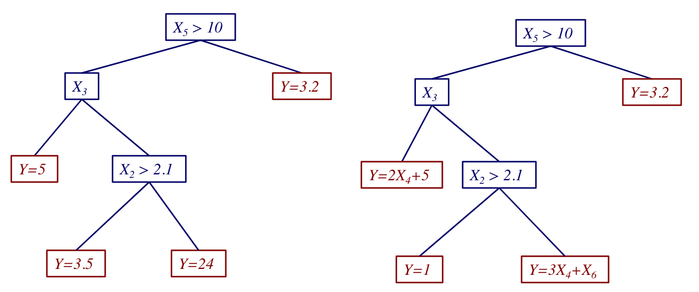

# Machine Learning 

## Feb. 6, 2019

Today we focus on overfitting and inductive bias.

**How to assess the accuracy of a decision tree?**

To get an unbiased estimate of a learned model's accuracy, we must use a set of instances that are held aside during learning. This set is called a _test set_.

### Overfitting

Overfitting is the selection of an incorrect model due to the training set or the algorithm that was employed. In terms of the training data, possible causes are data that does not represent the full population, noisy data, or false chance correlations between training data features and the class labels.

**Avoiding Overfitting in Decision Trees**

Two common methods for avoiding overfitting are _early stopping_ and _post-pruning_. In practice, pruning tends to perform better and is more frequently used.

Pruning: split the training set into a training set and a validation set, grow a complete tree, evaluate the validation set accuracy at each node, greedily remove the node that most improves the validation set accuracy.

**Regression Trees**

In a regression tree, leaves have functions that predict numeric calues instead of class labels.

To choose spits in regression trees, one strategy is to minimize the variance in the data at each internal node.

**Comments on Decision Trees**

- Widely used approach (most comonly in ensembles)
- Many variations in terms of pruning strategies and split decisions
- Efficient
- Provides a human-comprehensible model when trees are not too big
- Robust to sclaing of numeric features
- Standard methods learn _axis-parallel hypotheses_
- Standard methods not suited for on-line learning
- Usually not among the most accurate learning methods (unless in an ensemble)