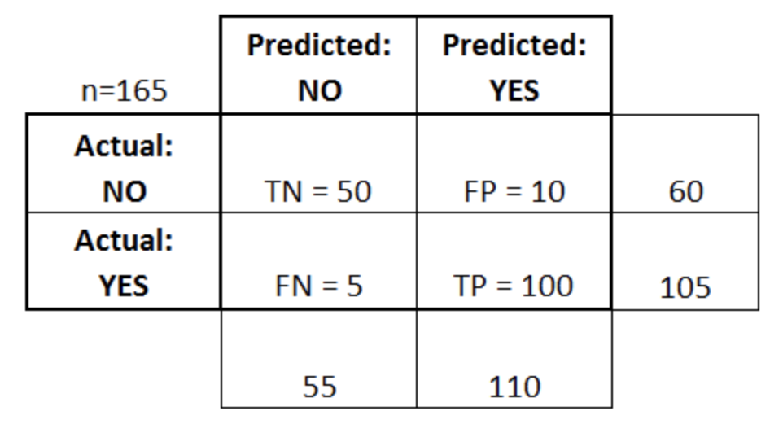

# Machine Learning 

## Feb. 8, 2019

### Inductive Bias

Inductive bias is the set of assumptions a learner uses to be able to predict y for a previously unseen instance x. There are two main components:

- _hypothesis space bias:_ determines the models that can be represented
- _preference bias:_ specifies a preference ordering within the space of models

In order to generalize to unseen data, a learning algorithm must have an inductive bias.

**Examples**

Decisions Trees: Decision trees partition the feature space with axis-parallel splits.

Inductive bias becomes a problem if the training set does not accurately represent all possibilities in the world. Dividing the training set into training and test sets is a good way to reduce inductive bias leading to overfitting.

Another possibility is that training set instances are collected with a temporal ordering, so it may be best to split the training set based on the date the sample wsa collected.

### Cross Validation

There are several possible ways of implementing cross validation

- k-fold
- Leave one out (k-fold where k = number of instances)
- and many more

A result of cross validation is that each fold may lead to a different model. The use of cross validation is to obatin an unbiased estimate of how well the model will perform on unseen data, rather than return the average of several models for prediction.

### Tuning sets

Divide data into training set and test set, then divide the triaing set into a sub-training set and a tuning set. Train all possible models and hyperparameters on the sub-training set, evelauate the accuracy on the tuning set to determine the best possible hyperparameters and model. Train this model on the full training set, and evaluate performance on the test set. This result is an unbiased estimate of the accuracy of the model. Train the model on the full data set and realease the model.

### Nested Cross Validation

A method for combining cross validation with the concept of tuning sets. Suppose k=10.

1. Randomly stratify the full data set into 10 folds
2. In the 9 training folds, select 1 fold to be the tuning set and the other 8 will become the sub-training set
3. Train on the sub-trianing set and evaluate performance on the tuning set
4. This will lead to one best model for each of the 10 folds.
5. At this point, repeat the outer 10 fold cross validation with all ten models, choose the best one based on accuracy, then train the best model on the full data set.

### Learning Curves

Plotting the accuracy as a function of the training set size shows whether we need more data to perform better

### Model Evaluation Metrics

Confusion Matrix = Contingency Table = n x n Table : collect true positives, false positives, true negatives, false negatives

True Positive Rate (TPR) = Recall = Sensitivity = TP / (TP + FN)

False Positive Rate (FPR) = FP / (FP + TN)

Precision = Positive Predicted Value (PPV) = TP / (TP + FP)

Receiver Operating Characteristic (ROC) Curve = TPR as a function of FPR