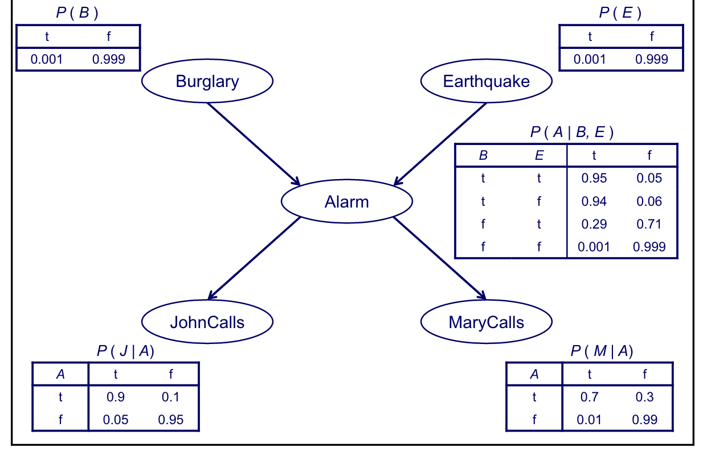

# Machine Learning 

## Feb. 13, 2019

### Learning Bayesian Networks

**Topics:** the Bayesian network representation, inference by enumeration, MCMC and Gibbs sampling, the parameter learning task, the structure learning task, maximum likelihood estimation, Laplace estimates, _m_-estimates, missing data in machine learning, the EM approach to imputation

**Example:** Consider 5 binary random variables. We also adopt the notation that _b_ represents B in the true state and __b__ represents B in the false state.

- B = a burglary occurs at your house
- E = an earthquake occurs at your house
- A = the alarm goes off
- J = John calls to report the alarm
- M = Mary calls to report the alarm



**Formal Definitions**<br>

- A BN consists of a Directed Acyclic Graph (DAG) and a set of conditional probability distributions.
- In the DAG, each node denotes a random variable, ach edge from _X_ to _Y_ represents that _X_ directly influences _Y_, each variable _X_ is independent of its non-descendents given its parents
- Each node _X_ has a conditional probability distribution (CPD) representing P(_X_ | _Parents_(_X_))
- Using the chain rule, a joint probability distribution can be expressed as $P(X_1,\cdots,X_n) = P(X_1)\product_{i=2}^n P(X_i | X_1. \cdots, X_{i-1})$

For our example we can calculate probabilities via $$P(B,E,A,J,M) = P(B) P(E) P(A | B, E) P(J | A) P(M | A)$$

**Advantages of Bayesian Networks**

- Captures independence and conditional independence where they exist
- Encodes the relevant portion of the full joint amoung variables where dependencies exist
- Uses a graphical representation which lends insight into the complexity of inference

**The Inference Task**<br>
_Given:_ Values for some variables in the network and a set of query variables<br>
_Do:_ Compute the posterior distribution over the query variables

Notes: (1) Variables that are neither evidence variables nor query variables are hidden variables. (2) The BN representaiton is flexible enough that any set can be the evidence variables and any set can be the query variables

_Inference by Enumeration_ <br>
Again returning to our example, suppose we want to calculate P(b | j,m). We can start by reading off from the graph that P(b,j,m) = $\sum_E \sum_A$ P(b)P(E)P(A|b,E)P(j\A)P(m|A). Do an equivalent calculation for P(__b__, j, m). Then from Bayes's law, we have

$$ P(b|j,m) = \frac{P(b,j,m)}{P(j,m)} = \frac{P(b,j,m)}{P(b,j,m) + P(__b__,j,m)} $$

_Approximate Inference (MC)_<br>

- Basic idea: repeatedly sample according to the distribution represented by the Bayes Net. 
- Give up on independence in sampling
- Generate next setting probabilitsically based on current setting
- MH algorithm for the gerenal case, Gibbs Sampling for Bayes nets in particular
- Detailed balance yields stationary distribution

_MCMC and Gibbs Sampling_<br>

```python
state = random assignment to non-evidence variables
for i in range(len(num_samples)):
	for x in non_evidence_variables:
		sample x according to P(x | Parents)(x))
		state = state with new value of x
P(F) = fraction of states in which F is true
```

_General Comments_

- Inference by enumeration is an exact tast, in that it will compute an exact answer to a given query
- However, it is computationally expensive since it requires summing over a joint distribution of exponential size in the number of variables
- In large netweoks, we can typically save computation by pushing sums inward
- hj
