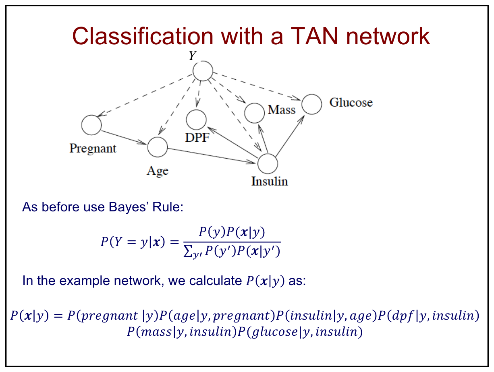

# Machine Learning 

## Feb. 18, 2019

### Bayesian Networks for Classification

Today we will discuss two classifiers that employ Bayes nets: Naive Bayes and Tree Augmented Network (TAN) algorithm.

### Naive Bayes

This is one very simple BN approach for supervised tasks. The structure assumes that any two features are conditionally independent of each other, and for that reason is referred to as "naive".

**Learning Task:** First estimate P(Y=y) for each value of the class variable Y, then estimate P(Xi = x | Y = y) for each Xi

**Classification:** Use Bayes' Rule to compute probabilities

**Pros and Cons:** The algorithm is simplistic, so it is very resistant to overfitting and efficient, but at the same time there are several functions that it cannot successfullt model. It is also very robust to missing data, because feature values are assumed to be conditionally independent. The algorithm performs poorly in situations where the assumptions of conditional independce is far from accurate.

### The Tree Augmented Network

The TAN algorithm attempts to keep the good qualities of Naive Bayes while addressing the issue that it relies on the conditional independence of features. Overall, the algorithm weights the edges in a Naive Bayes Net to determine where the assumption of independence is most violated. The steps are displayed below:

1. Compute the weight I(Xi, Xj | Y) for each possible (Xi, Xj) between features
2. Find the maximum weight spanning tree (MST) for graph over all Xi
3. Assign edge directions in the MST
4. Construct a TAN model by adding node for Y and an edge from Y to each Xi

_Example:_ In the example below, the dashed edges are the Naive Bayes classifier and the solid edges are edges determined by the MST.

### Comments on Bayesian Networks

- Easy to encode domain knowledge since dependencies, causality, and probabilities are explicit
- Can represent continuity
- Principled methods for dealing with missing values
- For supervised tasks, it is better to use a learning approach (ie TAN) that focues on dependencies that are the most important
- highly accurate
- also works on continuous variables
- BNs are one instance of a more general class of probabilistic graphical models

