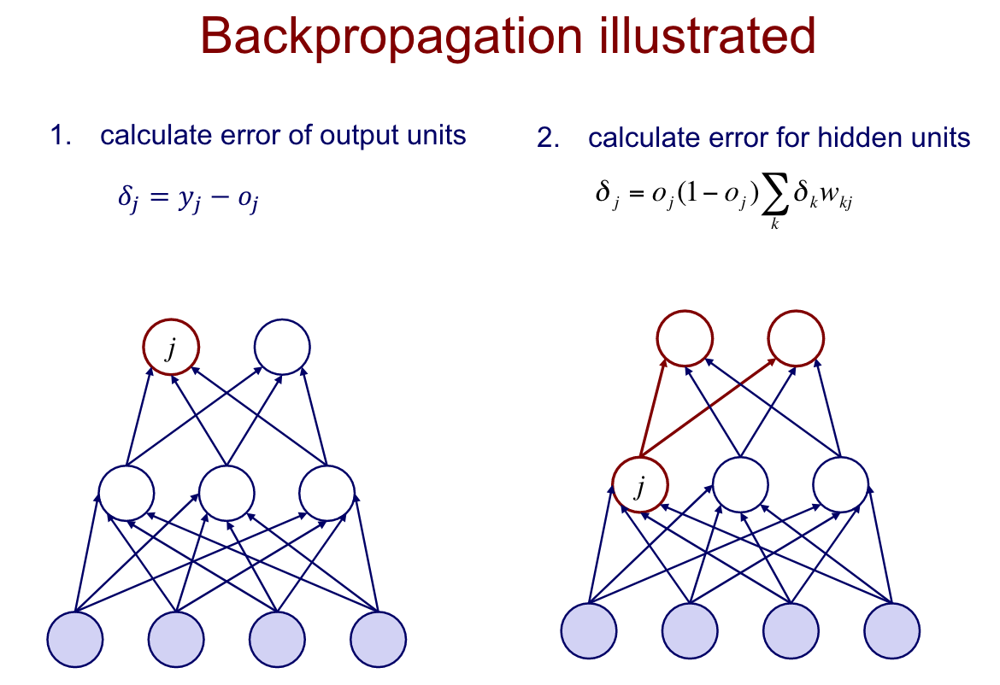
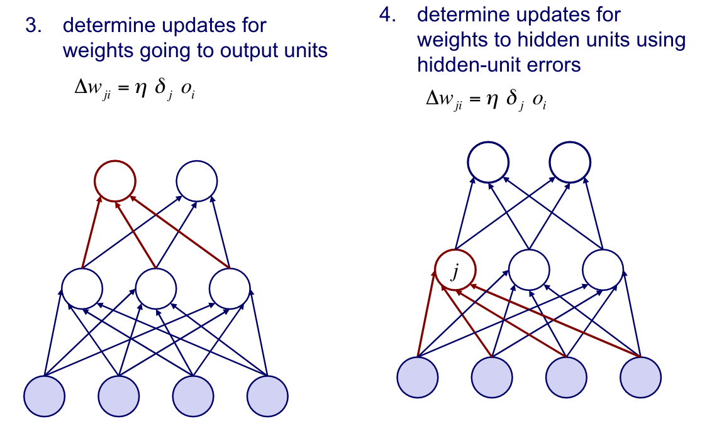

# Machine Learning 

## Feb. 22, 2019

### Backpropagation
We have discussed gradient descent for single-layer networks, but we wish to generalize the procedure to a multi-layer network. The general idea is to _backpropagate_ errors from output units to the hidden units.

The steps are displayed below with accompanying illustrations

Based on the error for the output, calculate the error for each hidden unit. This essentially assigns more blame to hiiden units if they were weighted heavily and the output was wrong, or assigns more faith in the hidden unit if the output was correct.

This process is continued all the way back to the start of the network. In this way, the hidden units can be optimized.