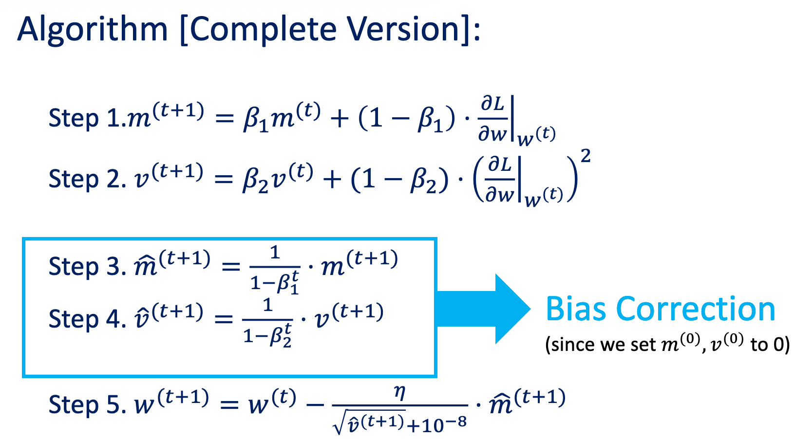

# Machine Learning 

## Feb. 25 - 27, 2019 

### Deep Learning

**Topics:** Regularization, One-hot encoding, autoencoders, denoising autoencoders, recurrent neural networks, convolutional neural networks, parameter tying, pooling, dropout training, batch normalization, Nesterov momentum.

**Regularization:** An approach for avoiding overfitting by biasing the learning process away from completely fitting the training data. One example we have seen already is decision tree pruning. Let's look at some implementations of regularization in neural nets.

- Early Stopping: Compare training set error to validation set error as a function of training iterations (or complexitity of the classifier). Look for when validation error stops improving instead of just minimizing training error:

- Dropout: On each training iteration, randomly dropuout a subset of the units and their weights, ignore these units and do forward and backward propagation on the remaining network. During testing, use all weights but multiply each weight by the fraction of times it was used during training.

- Data Augmentation: Modify existing training examples in several ways to increase the number of training samples and add generality to your training set. A common use of this technique is in image classification where you can make a new training instance by rotating, mirroring, recentering, etc. and still keep the same identity in the training example.

**One-Hot Encoding:** For nominal-valued features with _n_ possible values, create _n_ boolean features with a one-to-one mapping to the nominal values.

**Thermometer Encoding:** Ordinal features can be represented by filling a vector an amount corresponding to its ordinal value. See the example below:

**Real-valued Features:** In most cases it is a good idea to scale your data so that features in the neural net have the same max and min values

**Learning Representations:** The feature representation of the information you are working with is the most significant factor in how well a system works. An appealing characteristic of multi-layer neural nets is that they are able to change the feature representation in order to optimize performance. In that context, one can think of the nodes in the hidden layer as new features constructed from the orignal features in the input layer.

_Question:_ Can we use multi-layer neural networks to learn the best encoding of our data into features?

**Autoencoders:** One approach to learn hidden-unit representations. The network is trained to reconstruct the inputs, and then the hidden units that do this successfully can be used as a new encoding for inputs. There are several ways to train autoencoders:

- bottleneck: Use fewer hidden units than inputs
- sparsity: use a penalty function that encourages most hidden unit activations to be near zero
- denoising: train to predict true input from corrupted input
- contractive: force encoder to have small derivatives of hidden unit output as input varies

Autoencoders can also be stacked (Bengio et al. NIPS 2006):

**Initializing Weights:** It is a good idea to initialize all weights to small random numbers. Typical values are [0,1].

- Small: Activation function derivatives are typically largest close to zero, so the learning will be the most efficient in this regime.
- Random: If weights are all given the same value, the hidden units will all take the same value for a given feature, which takes away the ability of the network to pici out different aspects of the training features.

**Learning Rates:** Large learning rates can lead to low accuracy, while small learning rates can make convergence difficult to reach. In practice, it is best to use an adaptive learning rate of some form, and we will discuss this concept later on.

## Learning Algorithms in Neural Nets
**Steepest Descent:** (Gradient Descent) In each iteration, update the weight by the learning rate multiplied by the gradient of the error function with respect to the the current weight. 

**Momentum:** In each iteration, update each weight by the _velocity_. Velocity in this context is the running average of all gradients. The velocity is updated in each iteration by multiplying the current velocity by a learning parameter $\mu$ and then sumtracting the tradtional learning rate multiplied by the gradient of the error funciton.

For large values of mu, momentum will overshoot the target, but still converge faster than steepest descent. For small values of mu, momentum will approach steepest descent.

**Nesterov Accelerated Gradient:** This learning algorithm uses the same structure as momentum, by using the velocity to decrease the convergence time, but now we change the way the velocity is updated to reduce how much the learning algorithm bounces around before convergence. 

By evaluating the gradient of the loss funciton in weight space using the velocity, the weight updates become more accurate and more focused towards the convergence point. Nesterov Accelerated Gradient has been shown to outpreform momentum (Ilya et al., 2013). The comparison below illustrates geometrically how the weights are updated:

We can think of this algorithm as a look-ahead approach to the momentum algorithm. 

**AdaGrad:** (Adaptive Gradient) Instead of updating the weights in the same way, like we have done so far, consider using different learning rates for different weights. This method is documented in Duchi et al., 2011.

Here we scale the learning rate by all previous gradients, meaning arrive at new positions  in the weight space more quickly in the case of big jumps and we are able to stop more quickly when we appraoch the convergence point.

**RMS Prop:**

**Adaptive Moment Estimation:** This approach is the industry standard.

