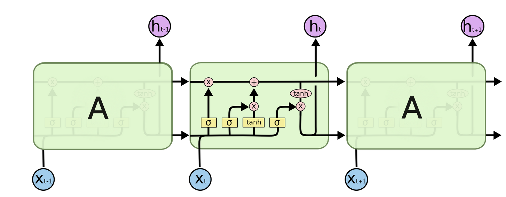
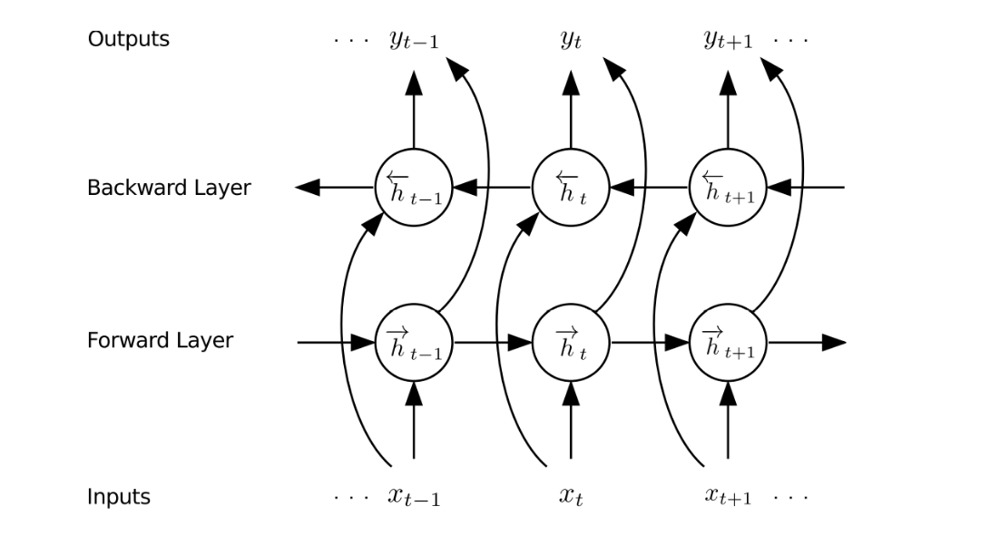
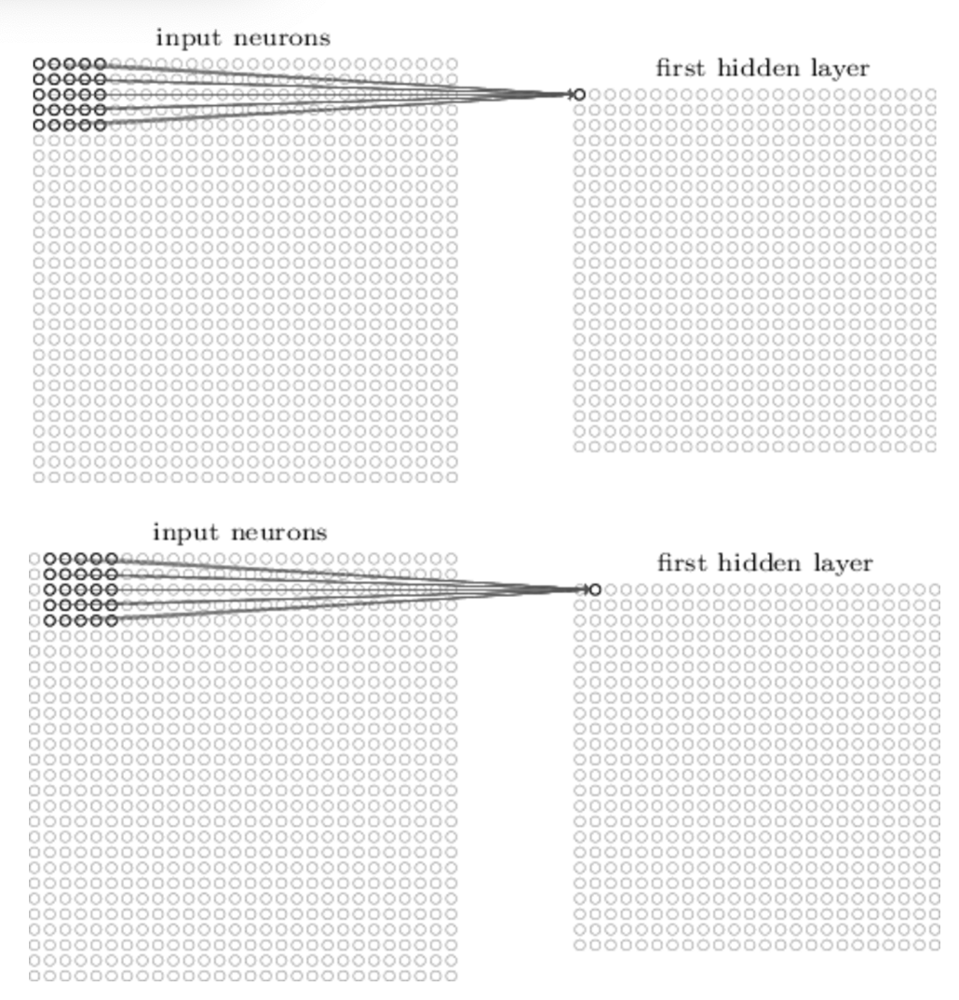
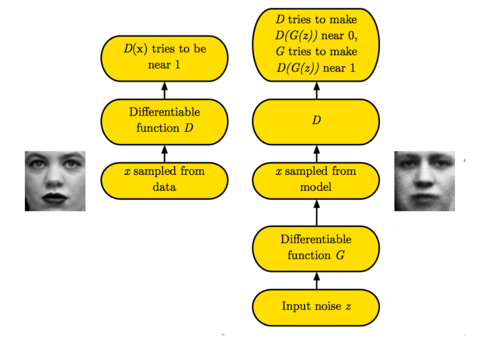
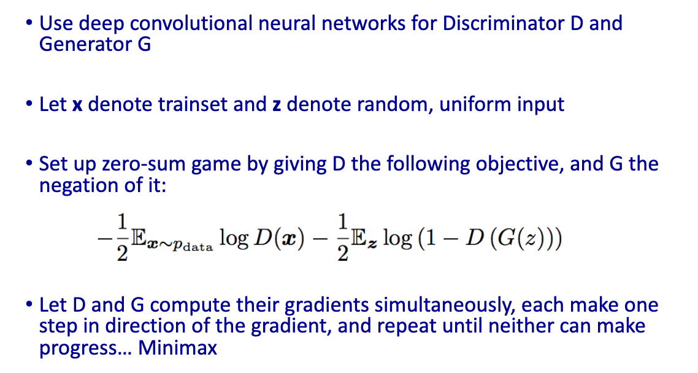
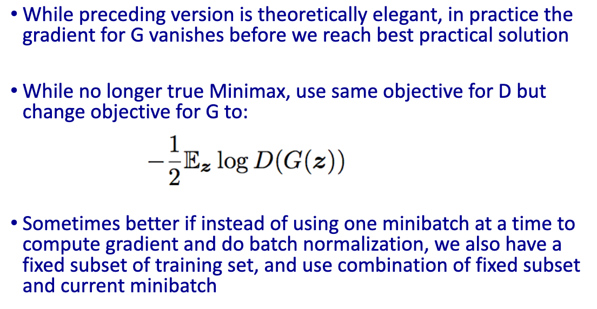

# Machine Learning 

## Mar. 6-11, 2019 

### Neural Network Architectures

**Topics:** parameter tying, recurrent neural nets, long short term memory networks, bidirectional lstm networks, convolutional networks

**Parameter Tying**

An a priori decision to require that certain connections in the network share the same weight.

## Recurrent Neural Networks

**Sequential Tasks** Some applications involve processing sequences of data (natural language, biological sequences, time-series data). As an example consider natural language.

*Examples:* Consider a task where we want to tag each word in a sentence by the part of speech (noun, verb, etc.) that it is being used as. You may also want to do sentiment analysis, which is to determine whether a sentence is positive or negative.

In dequential tasks, it may be valuable to have the network process vary-length input sequences and remember information when processing a sequence. Recurrent neural nets enable this behavior. Here are two simple approaches.

- Elman networks: Recurrent connections for from hidden units to inputs
- Jordan networks: Recurrent connections for from output units to inputs

Overall, the structure can be thought of as doing fixed-length backpropagation at every step of the network. This way, we allow th netwrok to use the information from previous elements in the sequence to help influence the decisions made about the current element.

**Long Short Term Memory (LSTM) Networks:** RNNs are well-suited to sequence data, and because they take into account recent performance, one can think of them as modeling human short-term memory. Depending on the type of problem you are faced with and the degree to which you believe early events vs late events may influence the final output, you can set the number of elements that are kept in the short term memory of the network.

See [this source](http://colah.github.io/posts/2015-08-Understanding-LSTMs/) for a nice discussion and illustrations of LSTMs. 

LSTM Netwroks have architecture for determining what informationis useful to remember / forget. They are composed of modules like this:

The goal is to determine which information needs to be remembered and which information can be safely forgotten. Definitely read the posted source as it contains a step-by-step walkthrough of all functions within each module.

**Bidirectional LSTM Networks:**

BiLSTM Networks have provided state of the art accuracy in natural language processing tasks. It is illustrated below, but combines the previous architecture with a backward layer to analyze the sequence from both ends.

## Convolutional Neutal Networks

CNNs focus on local features and try to build up global features. They are well suited for tasks where the input has spatial structure (typically images or sequences). The structure is based on four keys ideas:

- Local receptive fields
- weight sharing (parameter tying)
- pooling
- multiple layers of hidden units

*Local Receptive Fields:* input features that are close to each other wihtin the context of the spatial layout of the entire input are grouped together. This process is illustrated below. 

*Pooling:* Each unit in a pooling layer outputs a max (or similar function) from the input layer which is typically a feature map as illustrated above.

Typically you end the network with some fully collected layers to work on the features detected by the previous layers

## Generative Adversarial Networks (GANs)

- A Generative model takes a training set and learns to prepresnet an estimate of the distribution of training instances
- In some applications you can use this to create new instances
- Combine deep net (such as CNN or RNN) with adversarial training
- One network tries to generate data to fool a second network
- Second network tries to discriminate fake from real data

Approach: Set up a zero-sum game between deep nets.

- Generator: Generate data that looks like the training set
- Discriminator: Distinguish between real and synthetic data

Overview:

### Vanishing Gradient Problem
If a gradient's magnitude becomes small, the weights will barely be updated, so little training will occur. For sigmoid activation functions, this can happen when there are large differences between the prediction and output.

Ways to alleviate the vanishing gradient problem:

- ReLU activation functions tend to outperform sigmoids in this sense because they only saturate in one direction
- stack auto encoders to train the network layer by layer
- sparsely connected networks (such as CNNs)
- residual connections that skip layers

## General Comments on Neural Nets

- Many other architectures and training variants exist
- Neural nets are very flexible in terms of how you train, structure, etc.
- Recent advances have made neural nets very powerful (relu to handle vanishing gradients, dropout to avoid overfitting, convolutions and other archtectures attack different problems, and large datasets / hardware to enable training)
- Another style of DNNs called Restricted Boltzmann machines (RBMs) has also been successful
- SGD often works very well and many good models can be produced by a simpler structure

