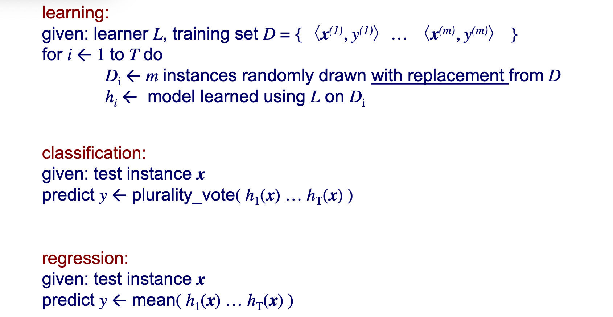
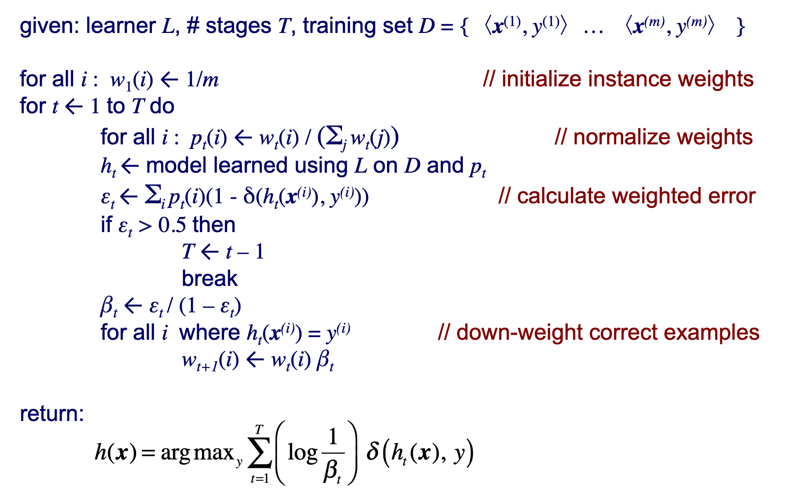
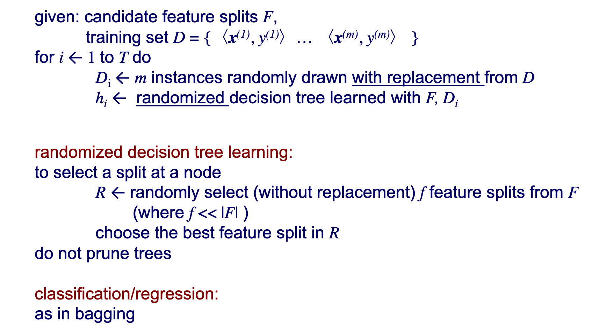

# Machine Learning 

## Mar. 13-15, 2019 

### Simple Linear Models

**Linear Regression:**

- Assumes a linear relationship between the independent adn dependent variables
- Assumes the noise in the measurements of the independent variable is sampled from an underlying Gaussian distribution
- Ordinary Least Squares (OLS) uses the sum of the square of the diffenerce between the actual output and predicted output as the loss function to minimize

**Multivariate Linear Regression:**

- Use the same structure as linear regression, but with a weight vector and feature matrix 

## Ensembles

Ensembles tend to perform better than single models based on binomial probability...

Only works well with diverse classifiers such that the performances are uncorrelated

How do we get diverse classifiers?

- Choose a variety of learning algorithms
- Choose a variety of hyperparameters
- Choose different subsamples of the training set (bagging)
- Use different probability distributions over the training instances (boosting)
- Choose different features and subsamples (random forests)

**Bagging (or Bootstrap Aggregation)**

Each sampled training set is a _bootstrap replicate_
 
 - sampling is done with replacement
 - contains on average 63.2 % of the original training set
 - some instances appear multiple times

Bagging can be incorporated into any learning algorithm and works best with unstable learning methods (those for which small changes in the training set result in relatively large changes in learned models). **Methods that tend to overfit are generally much improved by bagging.**

**Boosting**

Boosting came out of PAC learning analysis. A weak PAC learning algorithm is one that cannot PAC learn for arbitrary $\epsilon$ and $\delta$, although its hypotheses are slightly better than random guessing.

AdabBoost is a boosting algorithm that has had notable practical success.

**Random Forests**

